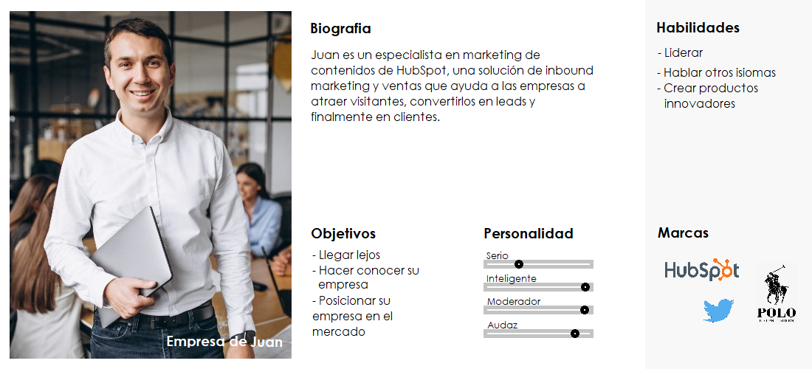

# Elicitación

## Ingeniería inversa

Nos basamos en la aplicación [mobills](https://www.mobillsapp.com/es) que anteriormente uno de los integrantes del equipo utilizo para manejar sus gastos.

### Conclusiones de Ingeniería inversa:

* En la pantalla principal podemos: 
  * Agregar un ingreso/gasto de forma intuitiva y fácil mediante iconos
  * Ver el saldo actual de la cuenta
  * Ver los gastos/ingresos 
* A cada ingreso/gasto se le puede adjuntar una descripción
* Para cada ingreso/gasto se puede elegir una categoría, así como: comida, ropa, inversión, etc.
* Mostrar gráfico con gastos e ingresos por categoría
* Se puede crear un presupuesto de dinero mensual
* Es posible ver un calendario con la actividad de la cuenta

## Lluvia de ideas

* Crear categorías personalizadas
* Crear eventos y asociar gastos para ese evento
* Se pueden dividir los gastos de un evento entre las personas que asistieron
* Buscador que retorna los gastos/ingresos cuya descripción coincide con lo que se ingreso
* Apartado de ahorro donde se aconseja al usuario y se brinda distintas posibilidades de inversión
* Implementar método de pago blockchain
* Se puede crear un grupo del cual administrar los gastos ej: familia, empresa, organización
* Chatear entre los contactos (podría ser arriesgado)

## Entrevista

La entrevista es una manera de obtener información sobre un tema especifico que propone el entrevistador para poder así obtener respuestas y conclusiones para algunas preguntas. Luego estas se rejuntan de modo que se pueda obtener una visión global de lo respondido y llegar a una conclusión.

### Preguntas:

1\) ¿Tiene un trabajo estable actualmente?

2\) ¿Tiene actualmente alguna forma de gestionar sus gastos? ¿Cuál?

3\) ¿Usted ahorra parte de sus ingresos? ¿Posee inversiones? De no ser así, ¿por qué?

4\) ¿Ve necesario/útil una aplicación para llevar un registro de sus finanzas?

5\) ¿Se tomaría el tiempo de agregar un gasto a la aplicación manualmente o busca que la aplicación lo maneje automáticamente por usted?

6\) ¿Que métodos de pago utiliza mas frecuentemente?

7\) ¿Ve útil una aplicación que le de consejos de ahorro e inversión? 

### Conclusiones de la entrevista:

* A las personas promedio les sería útil una app que registre ingresos y gastos para llevar un mayor control sobre sus finanzas.
* Valoran que sea sencilla de utilizar de forma que no requiera mucho tiempo.
* Vimos que algunos de los entrevistados manejan plantillas de Excel para controlar sus gastos por lo que sería el mayor “competidor” en el área. Podría ser útil y una funcionalidad a agregar en un futuro el poder descargar los datos en formato CSV.
* Se valora la funcionalidad de poder agregar gastos/ingresos fijos por ej: sueldo, gastos (ute, ose, antel, swat, gastos comunes, etc)
* Se valora que el sistema actualice los datos automáticamente estando conectado a la Cuenta de Banco, dado que existen muchos métodos de pago como: tarjetas de débito/crédito, cuentas bancarias, efectivo. Habría que obtener los datos del lugar donde el usuario recibe sus ingresos.
* La mayoría de los entrevistados ahorran parte de su dinero por lo que les parece buena idea que la aplicación les de consejos de ahorro e inversión.
* Algunos respondieron que no poseen inversiones ya que no tienen el capital necesario ni el conocimiento para hacerlo.
* Sería útil que la app hiciera un estimativo de cuánto puede gastar el usuario por día hasta llegar a fin de mes teniendo en cuenta el dinero que posee actualmente en la cuenta.

## User Personas

Luego de realizar las entrevistas concluimos con que para esta app se podrían dividir los usuarios entre 3 tipos, de los cuales el usuarios podrá elegir uno para la creación de su perfil.

### Personal

### Grupo

### Empresa

