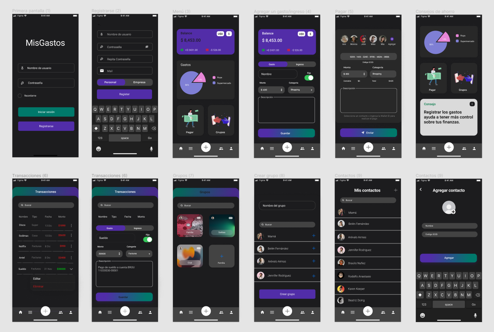

# Bocetos UI

Para los bocetos ui utilizamos la pagina Figma.com de la cual tuvimos que ir aprendiendo con el tiempo y nos dimos cuenta de que era bastante útil para desarrollar este tipo de tareas. Diseñamos una interfaz en modo claro y otra en modo oscuro oscuro porque nos pareció que es una herramienta que es necesaria debido a que si vamos a estar varias horas frente a la pantalla, el modo oscuro nos podría ayudar a permanecer mas tiempo en la app y trabajar mejor.

## Interfaz de usuario en modo claro

.png>)

## Interfaz de usuario en modo oscuro

