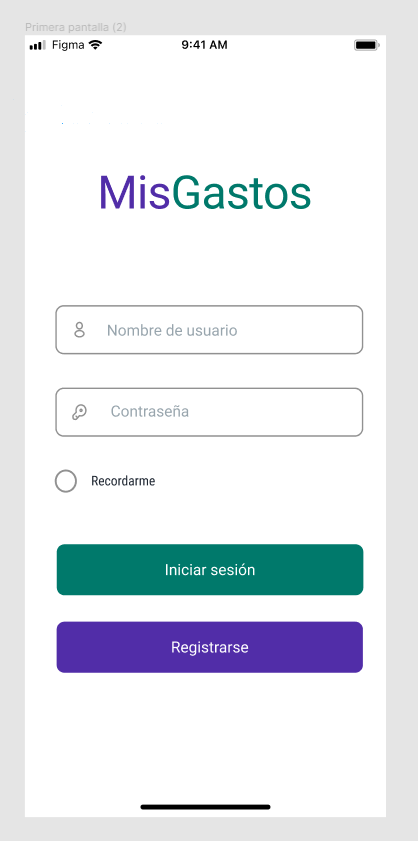
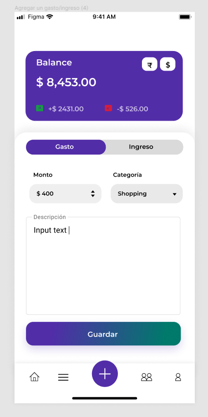

# Casos de uso

## Caso de uso 1

### Título: Iniciar sesión

#### Actor: Usuario

#### Curso normal: 

| Accion del actor                        | Reacción del sistema                                   |
| --------------------------------------- | ------------------------------------------------------ |
| 1) El usuario quiere iniciar sesión     | 2) Sistema muestra campos de texto para iniciar sesión |
| 3) El usuario llena los campos de texto | 4) El sistema inicia sesión con los datos del usuario  |

#### Curso alternativo: 

* El usuario no rellena un campo de texto obligatorio y presiona iniciar sesión.
* Aparece un mensaje de alerta diciendo que faltan datos por ingresar.
* Se vuelve al punto numero 2.
* El usuario intenta iniciar sesión con un perfil que no existe.
* Aparece un mensaje de alerta diciendo que los datos son incorrectos.
* Se vuelve al punto numero 2.

## Caso de uso 2

### Título: Registrarse

#### Actor: Usuario

#### Curso normal: 

| Accion del actor                                 | Reacción del sistema                                                |
| ------------------------------------------------ | ------------------------------------------------------------------- |
| 1) El usuario quiere registrarse                 | 2) Sistema muestra un botón registrarse desde la primer pantalla    |
| 3) El usuario hace click en el botón registrarse | 4) El sistema lleva a otra pagina con campos de texto para rellenar |
| 5) El usuario llena los campos de texto          | 6) El sistema registra al usuario con los respectivos datos         |

#### Curso alternativo: 

* El usuario no rellena un campo de texto obligatorio y presiona registrarse.
* Aparece un mensaje de alerta diciendo que faltan datos por ingresar.
* Se vuelve al punto numero 2.

.png>)

## Caso de uso 3

### Título: Agregar un ingreso/gasto

#### Actor: Usuario

#### Curso normal: 

| Acción del actor                                                | Reacción del sistema                                                         |
| --------------------------------------------------------------- | ---------------------------------------------------------------------------- |
| 1) El usuario quiere agregar un ingreso o un gasto              | 2) El sistema dispone de un botón que habilita esta acción (en forma de más) |
| 3) El usuario presiona el botón de agregar gastos o ingresos    | 4) El sistema muestra una nueva pantalla con campos para rellenar            |
| 5) El usuario rellena los campos con los datos correspondientes | 6) El sistema agrega un ingreso o gasto                                      |

#### Curso alternativo: 

* El usuario no rellena un campo de texto obligatorio y presiona agregar.
* Aparece un mensaje de alerta diciendo que faltan datos por ingresar.
* Se vuelve al punto numero 4.
* El usuario intenta agregar un ingreso o un gasto con monto negativo.
* Aparece un mensaje de alerta diciendo que los datos son incorrectos.
* Se vuelve al punto numero 4.

## Caso de uso 4

### Título: Agregar contacto

#### Actor: Usuario

#### Curso normal: 

| Acción del usuario                                                      | Reacción del sistema                                                                                        |
| ----------------------------------------------------------------------- | ----------------------------------------------------------------------------------------------------------- |
| 1) El usuario quiere agregar a un familiar suyo como contacto en la app | 2) El sistema dispone de un botón "contactos" en el menú                                                    |
| 3) El usuario hace click en el botón contactos                          | 4) El sistema abre otra pagina con un campo de texto para agregar contactos por su código de identificación |
| 5) El usuario rellena el campo                                          | 6) El sistema agrega ese contacto                                                                           |

#### Curso alternativo: 

* El usuario coloca un código de un usuario que no existe
* El sistema muestra un mensaje diciendo que no existe ningún usuario con ese código
* El sistema vuelve al punto 4

## Caso de uso 5

### Título: Realizar transacción

#### Actor: Usuario

#### Curso normal: 

| Acción del usuario                                                               | Reacción del sistema                                             |
| -------------------------------------------------------------------------------- | ---------------------------------------------------------------- |
| 1) El usuario quiere realizar una transacción con otro contacto                  | 2) El sistema dispone de un botón "Pagar" en el menú             |
| 3) El usuario hace click en el botón contactos                                   | 4) El sistema muestra los contactos y campos de texto a rellenar |
| 5) El usuario selecciona un contacto y rellena correctamente los campos de texto | 6) El sistema realiza la transacción                             |

#### Curso alternativo: 

* El usuario no rellena uno de los campos
* El sistema muestra un mensaje diciendo que no relleno todos los campos obligatorios
* El sistema vuelve al punto 4
* El usuario coloca un monto negativo
* El sistema muestra un mensaje diciendo que no pueden haber montos negativos
* El sistema vuelve al punto 4
* El usuario no selecciona un contacto para realizar la transacción
* El sistema muestra un mensaje diciendo que no ha seleccionado con quien quiere realizar dicha transacción
* El sistema vuelve al punto 4

