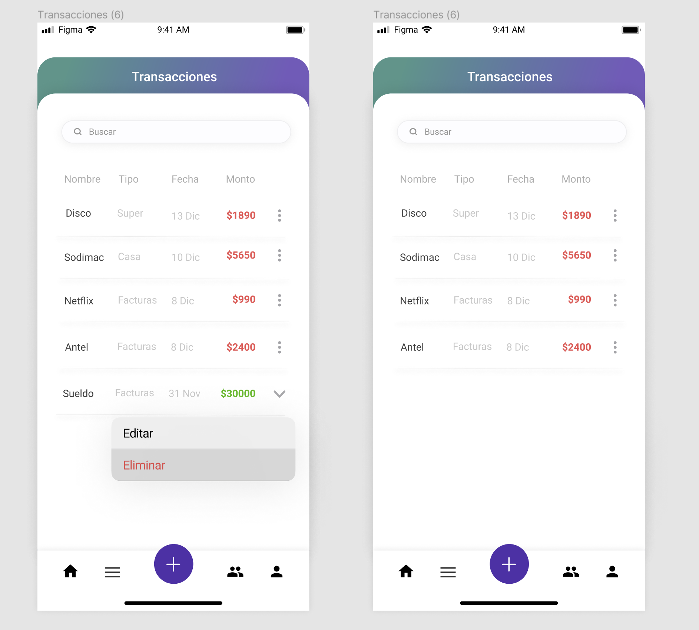

# Casos de uso

## Caso de uso 1

### Título: Iniciar sesión

#### Actor: Usuario

#### Curso normal:&#x20;

| Accion del actor                        | Reacción del sistema                                                           |
| --------------------------------------- | ------------------------------------------------------------------------------ |
| 1) El usuario quiere iniciar sesión     | 2) Sistema muestra campos de texto para iniciar sesión                         |
| 3) El usuario llena los campos de texto | 4) El sistema inicia sesión con los datos del usuario y abre el menú de inicio |

#### Curso alternativo:&#x20;

3\. 1. El usuario no rellena un campo de texto obligatorio y presiona iniciar sesión: aparece un mensaje de alerta diciendo que faltan datos por ingresar

3\. 2. El usuario intenta iniciar sesión con un perfil que no existe o la contraseña es incorrecta: aparece un mensaje de alerta diciendo que los datos son incorrectos.

.png>)

## Caso de uso 2

### Título: Registrarse

#### Actor: Usuario

#### Curso normal:&#x20;

| Accion del actor                                 | Reacción del sistema                                                |
| ------------------------------------------------ | ------------------------------------------------------------------- |
| 1) El usuario quiere registrarse                 | 2) Sistema muestra un botón registrarse desde la primer pantalla    |
| 3) El usuario hace click en el botón registrarse | 4) El sistema lleva a otra pagina con campos de texto para rellenar |
| 5) El usuario llena los campos de texto          | 6) El sistema registra al usuario con los respectivos datos         |

#### Curso alternativo:&#x20;

5\. 1. El usuario no rellena un campo de texto obligatorio y presiona registrarse: aparece un mensaje de alerta diciendo que faltan datos por ingresar.

5\. 2. El usuario no ingresa la misma contraseña las dos veces: aparece un mensaje de error notificando que la contraseña es incorrecta.

5\. 3. El usuario intenta registrarse con un correo de una cuenta ya existente: aparece un mensaje de error notificando que existe una cuenta asociada a ese correo.

 (1) (1).png>)

## Caso de uso 3

### Título: Agregar un ingreso/gasto

#### Actor: Usuario

#### Curso normal:&#x20;

| Acción del actor                                                | Reacción del sistema                                              |
| --------------------------------------------------------------- | ----------------------------------------------------------------- |
| 1) El usuario quiere agregar un ingreso o un gasto              | 2) El sistema dispone de un botón que habilita esta acción        |
| 3) El usuario presiona el botón de agregar gastos o ingresos    | 4) El sistema muestra una nueva pantalla con campos para rellenar |
| 5) El usuario rellena los campos con los datos correspondientes | 6) El sistema agrega un ingreso o gasto                           |

#### Curso alternativo:&#x20;

5\. 1. El usuario no rellena un campo de texto obligatorio y presiona agregar: aparece un mensaje de alerta diciendo que faltan datos por ingresar.

5\. 2. El usuario intenta agregar un ingreso o un gasto con monto negativo: aparece un mensaje de alerta diciendo que no puede ingresar montos negativos.

.png>)

## Caso de uso 4

### Título: Editar un ingreso/gasto

#### Actor: Usuario

#### Curso normal:&#x20;

| Acción del usuario                                         | Reacción del sistema                                                                            |
| ---------------------------------------------------------- | ----------------------------------------------------------------------------------------------- |
| 1) El usuario quiere editar un gasto o un ingreso          | 2) El sistema dispone de una opción que sirve para ver el historial de transacciones anteriores |
| 3) El usuario clickea el botón de transacciones anteriores | 4) El sistema despliega una lista de transacciones anteriores que pueden ser editadas           |
| 5) El usuario selecciona una transacción a editar          | 6) El sistema redirige a otra pagina donde se pueden editar los datos y guardar cambios         |
| 7) El usuario rellena los campos y le da a guardar         | 8) El sistema guarda los cambios del ingreso/gasto                                              |

#### Curso alternativo:&#x20;

5\. 1. El usuario no posee transacciones anteriores, por lo tanto no puede editar

7\. 1. El usuario rellena el campo monto con monto negativo: el sistema rechaza y le muestra un mensaje de error

7\. 2. El usuario edita los datos y sale sin guardar los cambios

.png>)

## Caso de uso 5

### Título: Eliminar un ingreso/gasto

#### Actor: Usuario

#### Curso normal:&#x20;

| Acción del usuario                                            | Reacción del sistema                                            |
| ------------------------------------------------------------- | --------------------------------------------------------------- |
| 1) El usuario quiere eliminar un gasto/ingreso del sistema    | 2) El sistema dispone de un botón transacciones anteriores      |
| 3) El usuario hace click en el botón transacciones anteriores | 4) El sistema muestra una lista de las transacciones anteriores |
| 5) El usuario selecciona una de las transacciones             | 6) El sistema permite eliminar dicha transacción                |
| 7) El usuario hace click en eliminar                          | 8) El sistema borra dicha transacción                           |

#### Curso alternativo:&#x20;

5\. 1. No hay transacciones para eliminar

## Caso de uso 6

### Título: Agregar contacto

#### Actor: Usuario

#### Curso normal:&#x20;

| Acción del usuario                             | Reacción del sistema                                                                                                             |
| ---------------------------------------------- | -------------------------------------------------------------------------------------------------------------------------------- |
| 1) El usuario quiere agregar un contacto       | 2) El sistema dispone de un botón contactos                                                                                      |
| 3) El usuario hace click en el botón contactos | 4) El sistema despliega una lista de los contactos de los usuarios y permite agregar uno mediante su GCiD (código identificador) |
| 5) El usuario escribe el GCiD                  | 6) El sistema busca ese GCiD                                                                                                     |
| 6) El usuario hace click en agregar            | 7) El sistema agrega al contacto                                                                                                 |

#### Curso alternativo:&#x20;

5\. 1. El usuario coloca un código que no corresponde al formato requerido: el sistema muestra un mensaje diciendo que coloco un código que no es valido

6\. 1. El usuario coloca un código de un usuario que no existe: el sistema muestra un mensaje diciendo que no existe ningún usuario con ese código

.png>)

## Caso de uso 7

### Título: Realizar transacción

#### Actor: Usuario

#### Curso normal:&#x20;

| Acción del usuario                                                               | Reacción del sistema                                              |
| -------------------------------------------------------------------------------- | ----------------------------------------------------------------- |
| 1) El usuario quiere realizar una transacción con un contacto                    | 2) El sistema dispone de un botón pagar en el menú                |
| 3) El usuario hace click en el botón pagar                                       | 4) El sistema muestra los contactos disponibles y campos de texto |
| 5) El usuario selecciona un contacto y rellena correctamente los campos de texto | 6) El sistema realiza la transacción                              |

#### Curso alternativo:&#x20;

5\. 1. El usuario no rellena uno de los campos o no selecciona un contacto para realizar la transacción: el sistema muestra un mensaje diciendo que no relleno todos los campos obligatorios

5\. 2. El usuario coloca un monto negativo: el sistema muestra un mensaje diciendo que no se pueden ingresar costos negativos

5\. 3. El usuario no posee el monto a enviar: el sistema muestra mensaje notificando que no tiene saldo suficiente

5\. 4. El usuario no posee contactos, por lo tanto, no puede hacer una transacción

 (1).png>)

## Caso de uso 8

### Título: Crear un grupo

#### Actor: Usuario

#### Curso normal:&#x20;

| Acción del usuario                                           | Reacción del sistema                                                                                                      |
| ------------------------------------------------------------ | ------------------------------------------------------------------------------------------------------------------------- |
| 1) El usuario quiere crear un grupo                          | 2) El sistema dispone de un botón grupos en el menú                                                                       |
| 3) El usuario hace click en el botón grupos                  | 4) El sistema despliega una lista de los grupos en los que estoy y una opción de agregar                                  |
| 5) El usuario hace click en agregar                          | 6) El sistema despliega una pagina con un campo para el nombre del grupo y una lista de los contactos debajo para agregar |
| 7) El usuario llena los campos e invita personas si lo desea | 8) El sistema crea ese grupo con el nombre y personas seleccionadas                                                       |

#### Curso alternativo:&#x20;

5\. 1. El usuario no coloca un nombre de grupo: el sistema despliega un mensaje de error notificando que le faltan ingresar datos

 (1).png>)
