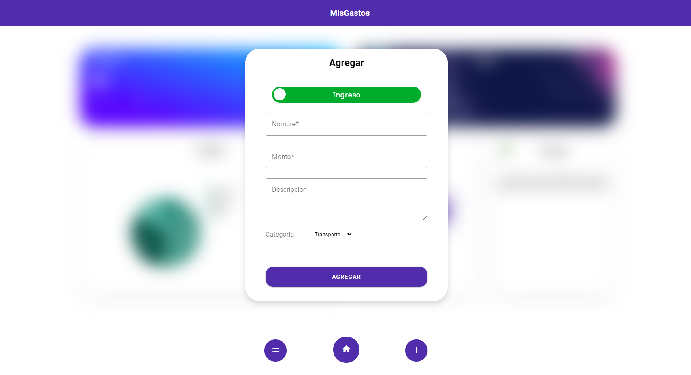
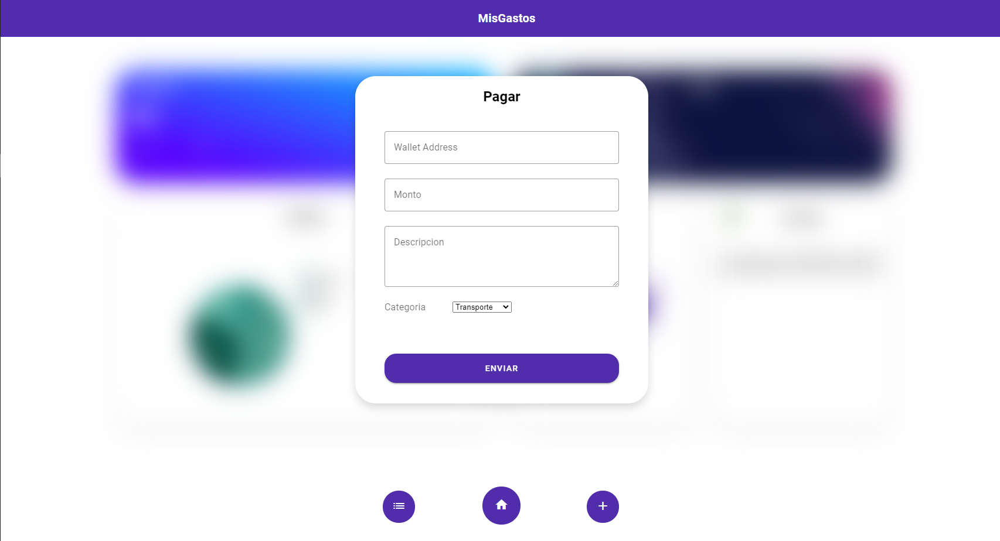

# Interfaz de usuario

## Interfaz de usuario web / mobile (responsive)

Nuestra idea principal era que fuera responsive pero no se llego a implementar esta característica en el programa, aunque lo único que no es responsive son los botones de la barra de abajo, las cards principales y la lista de transacciones.

## Pagina única con navegación entre secciones

Dentro de la pagina se pueden realizar varias funciones dentro de las cuales nos desplazamos sobre las secciones: "Menú", "Agregar", "Lista de transacciones" y "Pagar".

Dentro de cualquiera de las secciones tenemos una barra debajo con los botones de menú, transacciones y agregar para acceder a ellas cuando queramos.

A la sección "Menú" se accede mediante el botón menú y dentro de esta se pueden visualizar el balance total que lleva la persona ademas de los ingresos, gastos, las cards de "grupos" (no implementada), la gráfica generada automáticamente de los gastos según las secciones (no implementada), la de "pagar" y otra que dice consejos de ahorro e inversión.

A la sección "Agregar" se accede mediante el botón agregar y dentro de esta se puede agregar gastos o ingresos especificando su nombre, monto (obligatorios) y luego una descripción y categoría los cuales todos juntos se agregan a la lista de transacciones con el botón agregar.

A la sección "Pagar" se accede mediante el botón pagar y dentro de esta se puede realizar pagos a distintas cuentas mediante su wallet iD especificando monto, categoría y descripción las cuales se agregan a la lista de transacciones mediante el botón pagar.

A la sección "Lista de transacciones" se accede mediante el botón lista de transacciones y dentro de ella se pueden ver todas las transacciones que hemos realizado con su respectivo nombre, tipo,  monto, fecha y categoría.

### Menú

.png>)

### Agregar

### Pagar

### Lista de transacciones

## Implementacion: Material Design Web Components

Utilizamos los siguientes componentes para el material design:

* Top app bar
* Bottons
* Table
* Text Fields
* Integer fields
* Switch botton
* Alert boxes

## Aplicar un sistema de diseño y principios de usabilidad

Se representó la pagina mediante cards en el menú y una barra de botones debajo (a los cuales puedo acceder desde cualquier card) haciendo de esta manera que sea muy sencilla de usar con dibujos representativos en los botones o texto explicito para un entendimiento completo del usuario.&#x20;

## Cumplimiento de estándar de accesibilidad WCAG

Se cumple con los estándares de accesibilidad WCAG.&#x20;

* Perceptible:&#x20;
* Operable:&#x20;
* Entendible:&#x20;
* Robusto:&#x20;

## Seguir especificación de estilo

Anteriormente a realizar el proyecto se nos realizaron una serie de especificaciones para su realizado, muchas de las cuales se respetaron y formalizaron. Estas fueron:

* Nombre de la app: MisGastos
* Color primario: Deep purple 700
* Color secundario: Teal 700
* Font: Roboto
* Iconos: Filled
