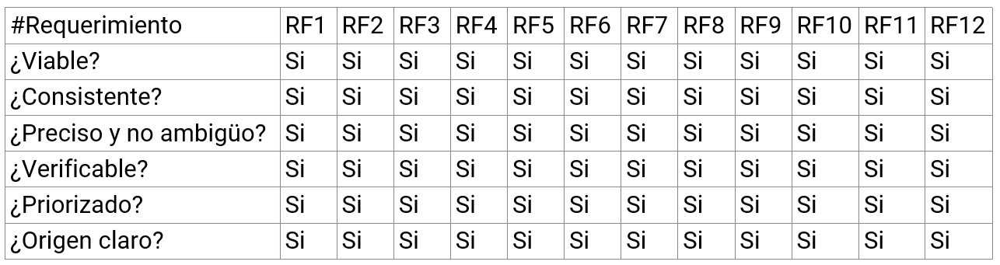

# Validación y verificación

## Verificacion

Verificamos entre los integrantes del grupo para comprobar que lo que estábamos haciendo estuviera bien y y si estábamos realizando las especificaciones pedidas por el cliente. De esta manera fue que para cada uno de los requisitos funcionales nos fijamos de que cada una de las características se cumpliera y actúe de la mejor posible.

